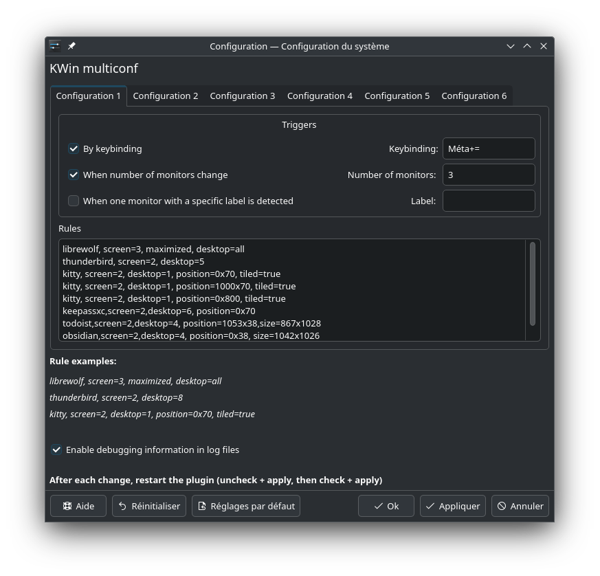

# KWIN Multiconf



**KWin Multiconf** is a KWin script for KDE 6 that allows you to manipulate windows and associate each configuration to a keybinding, or to a trigger linked to the monitors connected or disconnected.

For instance, KDE does not allow - currently - to have different configurations when your laptop is docked or undocked. This issue is solved by this script.

It makes also things easier to configure as you don't have to set up Window rules one by one, but in one text block. This is much faster to configure.


## Example of a real problem

I made this script to solve my own issue. When I dock my laptop, it's connected to 2 big monitor. On the right, I put my browser and I associate it to all virtual desktops. At the left, I have various things. When I change my current virtual desktop, my browser always remains on my second screen.

However, when I undock my laptop, this is an issue as I don't want my browser to be on all virtual desktops, but a different configuration. KDE natively does not propose a solution to this issue.

It solves also the "reloading" of Windows rules. Let's say that you defined your Windows rules. When you open your various programs, they are placed correctly where you want. However, during your session, you move Windows, and you would like to "reload" your rules to put Windows at their proper place. How to do it? I didn't find any solution. 

## Usage

Once installed, you need to define your different configurations in the settings of the script. Each of them is triggered by:

- A keybinding ;
- and/or a change in the number of monitors detected ;
- and/or the presence of a screen, defined by it's name or model. 

Then, you need to define your Windows rules in the text area. Each line contains all the rules for a particular Window/Program, separated by a comma. 

```
window1, parameter1, parameter2, parameter3, etc.
window2, parameter1, parameter2, parameter3, etc.

```


### Matching Windows

The first item of each line is always the class name of the Window, that you can obtain with the "detect Window property" button in "KWin rules". You just have to enter a substring, not the exact class name.

Sometimes, you may need to launch several instances of a program, and configure them in sequence. For instance, you may want to put the first Terminal on your first virtual desktop, the second one on the second, and the third on the third. In such a case, just add one line per terminal.

```
kitty,desktop=1
kitty,desktop=2
kitty,desktop=3
```
KWin Multiconf will be smart enough to understand that three different terminals are expected and will configure them independently.

### Rule parameters

The current available parameters are summarized in the following table:

| Parameter                    | Syntax examples                      |  Comment                         |
|------------------------------|--------------------------------------|----------------------------------| 
| screen                       | screen=2                            | Put the Window on the second screen |
| desktop                      | desktop=4                           | Put the window on the virutal desktop containing the substring "4" |
| maximized                    | maximized / maximized=true / maximized=false | Set the Window as maximized or not |
| minimized                    | minimized / minimized=true / minimized=false | Set the Window as minimized or not |
| position                     | position=30x85                         | Set the Window at a precise position |
| size                         | size=400x350                           | Set the Window size (widthxheight) |
| tiled                        | tiled / tiled=true / tiled=false  | Associate the window to the nearest tile |

Below are various notes about each parameter. 

#### Parameter: screen

On my computer, I've always the same order for the screens when I dock my computer (eg. the screen n°2 is always the same one), but I heard that this may not be the case for all people. Let me know if it's the case, I can develop something more reliable if needed. 


#### Parameter: desktop 

If you don't have numbers in your virtual desktop's names, you can put a string. For instance, `desktop=Dev` will match the first desktop containing "Dev" (case-sensitive). 

To force a window to be displayed on all desktops, juste type `desktop=all`

#### Parameter: maximized

You can use either `maximized` alone to maximize a window, or `maximized=true` according to your preference. Both are same. 

#### Parameter: minimized

Same as maximized.

#### Parameter: position

The syntax is `position=[X]x[Y]` (without the brackets), where X and Y is the position of the upper-left corner of the window on the current monitor.

If you need to change only X or Y, you can use the following syntax:

```
// The window will stay on the same X axis, but will be moved to the upper limit of the current monitor. 
position=x0
```

```
// Only the X axis will change
position=100x
```

#### Parameter: size

The syntax is `size=[width]x[height]` (without the brackets).

If you need to change only the width or the height of a window, just use the same trick as `position`.

```
// Only the width of the window will be changed, the height will remain as it is
size=400x 
```

```
// Only the height of the window will be changed, the width will remain as it is
size=x400 

```

#### Parameter: tiled

You can use either `tiled` or `tiled=true` to tile a Window into the nearest tile. `tiled` is usually used with `position`. As the rules for a window are executed from left to right, you need to position first the window, and then tile it to target the proper tile. 

**Important note:** Don't forget that if you resize a tiled Window, the tiled grid will change accordingly in all your virtual desktops, and even in other Activities! Therefore, during your session, if you need to resize a tiled window, move it first (so it will be untiled) and then resize it to not mess your tile grid.  

If you have any wrong behavior with `tiled`, before anything else check that your grid is what you expect with `Meta+T`.


### Reloading the script

At each configuration change, you'll need to uncheck the script and click "Apply", and then check the script and click "Apply" to reload it.
The scripts are not restarted automatically when the configuration changes.


## Troubleshooting

It's better to keep the log files enabled to troubleshoot any issue, at least for a few days or weeks.

The logs can be read with: `journalctl -f -g js`

If you have an issue, open an issue on Github with the log files and your configuration. 

### Keybindings not registering/not working

Sometimes the keybindings are not registered when they are set up and then changed.

If this happens, see the following issue: https://github.com/juienpro/kwin-multiconf/issues/2
